<div align="center">



*Our chain-of-density study of one paper — the paper stays canonical, we just take very good notes.*

[](https://arxiv.org/abs/2508.01581)
[](LICENSE.md)
-2ea44f)

-a371f7)

</div>

> **A notes repo, not a mirror.** This repo is our study of *Polymorphic
> Combinatorial Frameworks (PCF): Guiding the Design of
> Mathematically-Grounded, Adaptive AI Agents* — Pearl, Murphy &
> Intriligator, 2025 ([arXiv:2508.01581](https://arxiv.org/abs/2508.01581)).
> PCF asks: what if an AI agent were a *point in a mathematical space* —
> Skills, Personalities, Approaches, Resources, Knowledge — and adapting
> meant moving through that space, with topos theory throwing out the
> configurations that contradict themselves? Then it runs 1.25 million
> simulated café meals to find out where that stops working. No paper is
> hosted here; [the note](density-chain.md) is an original synthesis — our
> words, their findings, a locator on every claim.

> [!IMPORTANT]
> **The one-way rule.** When our note and the paper disagree, the paper wins
> and the note gets fixed. That rule is the entire reason we can call this
> note ground truth with a straight face.

**The note is a chain of five tiers,** each the same length, each denser than
the last — skim [T1](density-chain.md#t1--sparse) with your coffee, take
[T5](density-chain.md#t5--dense) into a design review. Every fact carries a
locator (§ section, Table N, Figure N) so you can walk it back into the paper
in one hop, and the *our take* section is the only place opinions are allowed
(quarantined, like all contagious things).

## 🏔️ Standing on the shoulders of giants

The actual science here was done by **David Pearl**,
**Matthew Murphy** ([@gusthemole](https://github.com/gusthemole)), and
**James Intriligator** — Department of Mechanical Engineering, Tufts
University, as printed on the paper. They built the framework, drafted topos
theory into agent design, and ran over a million simulated meals so the rest
of us could know where adaptability stops paying rent. We wrote a note about
it. Those are very different jobs, and only one of them deserves your
citation.

Do not cite "some repo on GitHub." Cite them — BibTeX below.

## 📥 Want the paper? One command, straight from the source

We don't keep a copy here (see: entire ethos, above). arXiv hosts it
beautifully, for free, forever — no middlemen, no photocopier smell:

```bash
curl -L -o pcf-adaptive-agents.pdf https://arxiv.org/pdf/2508.01581v1
```

Their experimental data and analysis tools live at
[cadavid1/PCF](https://github.com/cadavid1/PCF) — also straight from the
source.

## 📚 Cite the humans, not us

This repo is not a citable source; it's a signpost pointing at one. Official
BibTeX, straight from arXiv's export:

```bibtex
@misc{pearl2025polymorphiccombinatorialframeworkspcf,
      title={Polymorphic Combinatorial Frameworks (PCF): Guiding the Design of Mathematically-Grounded, Adaptive AI Agents},
      author={David Pearl and Matthew Murphy and James Intriligator},
      year={2025},
      eprint={2508.01581},
      archivePrefix={arXiv},
      primaryClass={cs.AI},
      url={https://arxiv.org/abs/2508.01581},
}
```

## How this note was made

The methodology lives in its own repo —
[chain-of-density](https://github.com/OpenCnid/chain-of-density) — including
[METHOD.md](https://github.com/OpenCnid/chain-of-density/blob/main/METHOD.md),
the full
[synthesis framework](https://github.com/OpenCnid/chain-of-density/blob/main/chain-of-density-synthesis-prompt.md),
and the `density-chain` Claude Code skill that produced this repo end to end.
The short version: study the paper at the source, extract evidence with
locators, densify at a fixed word budget, select by audit rubric — never
"densest wins." `index.json` carries the source pin and verification date for
machine consumption.

## Honest notes

- **Every number was studied at the source this session** — the ar5iv
  rendering of v1, pinned in the note's provenance. Zero came from memory.
- **Summaries are lossy by construction.** The locators are the refund
  policy: any claim walks back to the paper in one hop.
- **We will get things wrong.** When we do, the fix lands source-first and
  the correction is public history. If we've mangled this paper, open an
  issue — correcting the record *is* the project.
- **Disclosure: we know one of these people.** Matthew Murphy
  ([@gusthemole](https://github.com/gusthemole)) is a friend of the lab and a
  collaborator on our current project, and his Lexideck prompt-engineering
  curriculum is the direct ancestor of protocols wired into our own
  toolchain. The note above was verified against the paper exactly like
  every other note — friendship doesn't move the one-way rule — but you
  deserve to know.
- **A human and an AI wrote this repo together.** The human picked the paper;
  the AI kept adding citations. We disclose this because disclosure is sort
  of our whole thing.

## Layout

```
density-chain.md    the five-tier note on the PCF paper
index.json          source pin + verification metadata
AGENTS.md           the agents' front door — how to consume this note
assets/             banner art (S·P·A·R·K, load-bearing as always)
```

## License

Notes and prose: [CC BY 4.0](LICENSE.md) © OpenCnid Labs. The paper is the
authors' (also CC BY 4.0 — kindred spirits), and it stays that way.

---

<div align="center">
<sub>1.25 million meals were simulated in the making of this research. We didn't even get a coffee.</sub>
</div>
